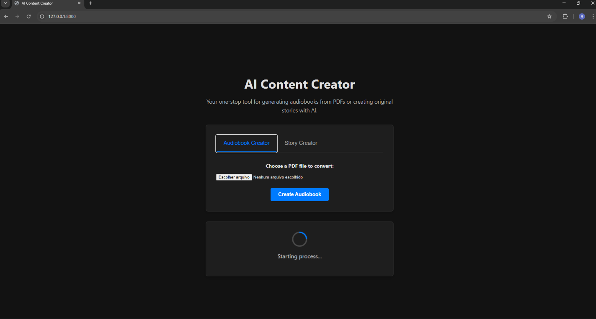
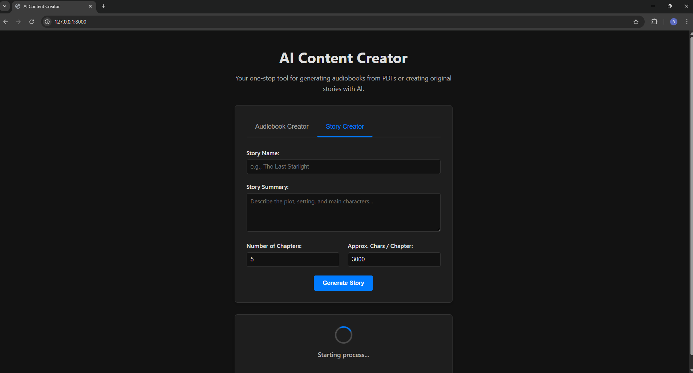
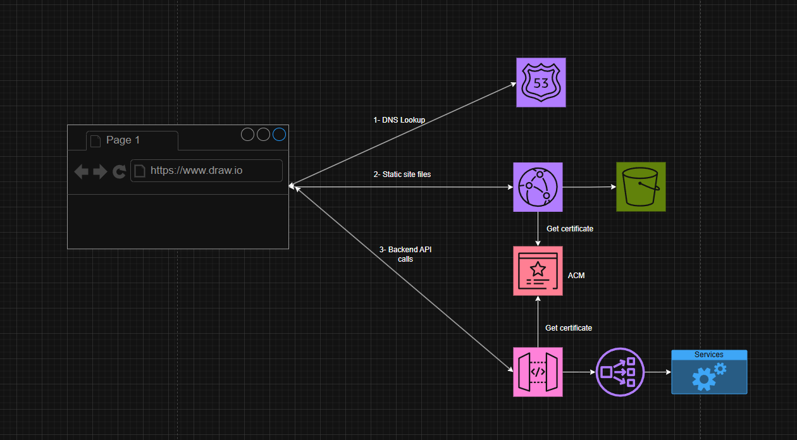
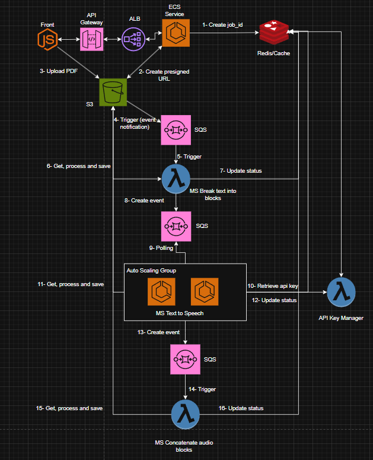
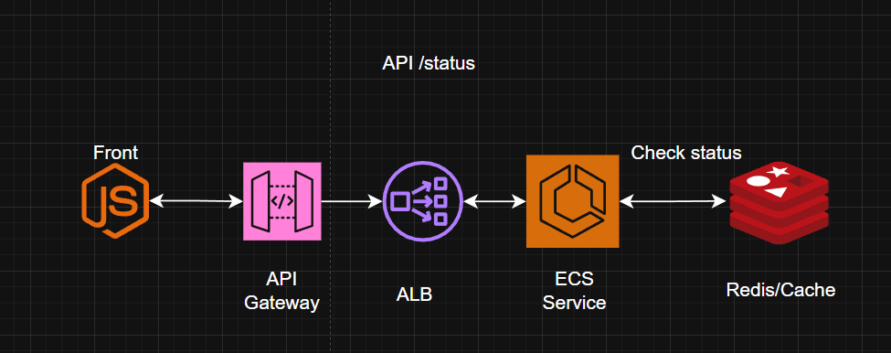
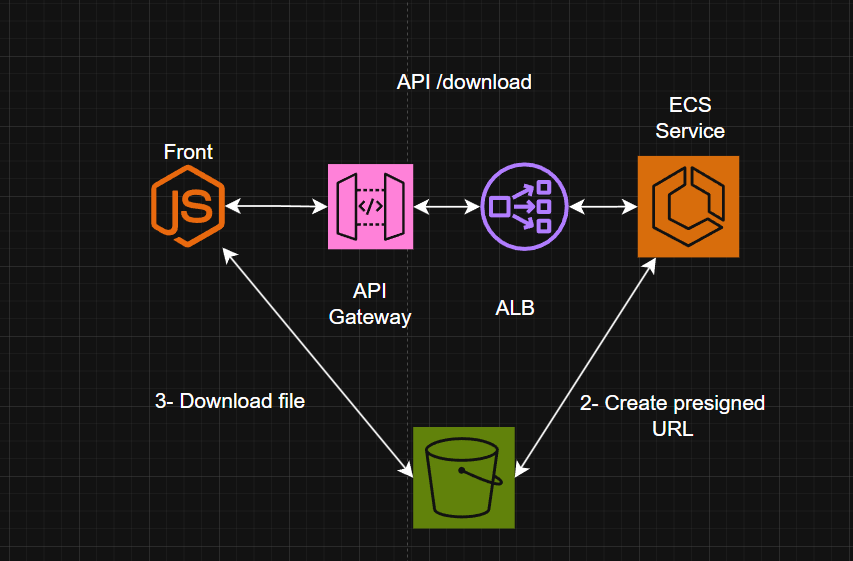

# AI Content Creator: Audiobook & Story Generator

This web application leverages the power of Google's Gemini API to serve as a versatile content creation tool. It can transform PDF documents into full-length audiobooks and generate original, multi-chapter stories from a simple user prompt. The application is built with a responsive FastAPI backend and a dynamic vanilla JavaScript frontend.




## ✨ Features

*   **PDF to Audiobook Conversion:**
    *   Upload any PDF file.
    *   Automatically splits text into intelligent blocks for high-quality Text-to-Speech (TTS).
    *   Generates audio for each block concurrently for speed, respecting API rate limits.
    *   Combines audio blocks with pauses into a single downloadable `.wav` file.
*   **AI Story Generation:**
    *   Provide a title, summary, and chapter details to generate a unique story.
    *   Uses a conversational AI session to maintain context and memory throughout the writing process.
    *   Generates a clean, downloadable `.pdf` of the final story using a Unicode-capable font for special characters.
*   **Dynamic User Interface:**
    *   Clean, tabbed interface to switch between the Audiobook and Story Creator tools.
    *   Real-time progress bar with percentage updates for long-running jobs.
    *   Asynchronous job processing—the UI remains responsive while the backend works.
*   **Robust Backend:**
    *   Built with modern FastAPI.
    *   Manages multiple Gemini API keys, automatically switching when a quota is exhausted.
    *   Built-in rate limiting to respect API usage policies.

## 🎯 Project Scope & Local Execution

This application was developed as a high-fidelity **Proof of Concept (PoC)** to demonstrate the end-to-end workflow of generating AI content. It is designed and optimized for **local execution** on a personal machine.

Several architectural choices were made for simplicity and rapid development, which are important to understand:

*   **In-Memory Job Management:** The `JobManager` stores all job statuses and progress in a simple Python dictionary. This data is volatile and will be **lost if the server restarts**.
*   **Built-in Background Tasks:** The application uses FastAPI's native `BackgroundTasks`. This is an excellent tool for in-process concurrency but is not as robust as a dedicated task queue. If the server process is terminated, any running tasks are lost.
*   **Monolithic Structure:** The same FastAPI server is responsible for both serving the frontend (HTML/JS) and handling the backend API logic.

As such, it is perfectly suited for personal use, demonstration, and as a strong foundation for a more complex, production-ready system.

## 🏛️ Local Architecture

The local application follows a monolithic client-server architecture with asynchronous background processing for long-running tasks.

*   **Frontend (Client):** A vanilla JavaScript application in the browser handles user input and polls the backend for job status.
*   **FastAPI Server:** A single server process that serves the static HTML/JS/CSS files and exposes the API endpoints.
*   **BackgroundTasks:** When a job is created, the API returns a `job_id` immediately, and the long-running task is executed in the background of the same process.
*   **JobManager:** An in-memory Python dictionary, protected by a thread lock, acts as the central state store for job progress.
*   **File System:** All job-related files are stored in a unique folder under `data/job-data/`.

## 🛠️ Technology Stack

*   **Backend:**
    *   Python 3.9+
    *   FastAPI & Uvicorn
    *   Google Generative AI SDK (`google-generativeai`)
    *   PyPDF2 (for PDF text extraction)
    *   Pydub (for audio manipulation)
    *   FPDF2 (for PDF generation)
    *   Jinja2 (for HTML templating)
*   **Frontend:**
    *   HTML5
    *   CSS3
    *   Vanilla JavaScript (no frameworks)

## 🚀 Getting Started (Local Setup)

### Prerequisites

*   Python 3.9 or higher.
*   Git (for cloning the repository).

### Installation & Setup

1.  **Clone the repository:**
    ```bash
    git clone https://your-repository-url/gen-audio-maker.git
    cd gen-audio-maker
    ```

2.  **Create and activate a virtual environment:**
    *   **Windows:**
        ```bash
        python -m venv .venv
        .\.venv\Scripts\activate
        ```
    *   **macOS / Linux:**
        ```bash
        python3 -m venv .venv
        source .venv/bin/activate
        ```

3.  **Install the required packages:**
    ```bash
    pip install -r requirements.txt
    ```

4.  **Configure your environment variables:**
    *   Create a `.env` file in the project root. You can copy the template:
        ```bash
        # For Windows
        copy .env.example .env
        # For macOS/Linux
        cp .env.example .env
        ```
    *   Open the `.env` file and add your credentials and settings.

### **⚠️ Important Note on Local Storage**

This application stores all generated files locally on your machine. For every job you run—whether an audiobook or a story—a new folder with a unique ID is created inside the `data/job-data/` directory. This folder contains the uploaded PDF, all intermediate text and audio blocks, and the final output file. Over time, this directory can grow quite large. It is recommended to periodically **clear the contents of the `data/job-data/` folder** to free up disk space.

### Environment Variables (`.env`)

*   `GEMINI_API_KEY_1`, `GEMINI_API_KEY_2`, etc.: Your Google AI Studio API keys. You must have at least one.
*   `GEMINI_TTS_MODEL`: The model for Text-to-Speech. Defaults to `"models/text-to-speech"`.
*   `GEMINI_TEXT_MODEL`: The model for text generation. Recommended: `"gemini-1.5-pro-latest"`.
*   `MAX_CONCURRENT_REQUESTS`: Number of simultaneous API requests for audio generation (e.g., `5`).
*   `API_REQUEST_LIMIT`: Max API calls allowed in the time window (e.g., `30`).
*   `API_REQUEST_WINDOW_SECONDS`: The time window for the rate limit in seconds (e.g., `60`).

### Running the Application

1.  With your virtual environment activated, start the server from the root directory:
    ```bash
    uvicorn app.main:app --reload
    ```
2.  Open your web browser and navigate to `http://127.0.0.1:8000`.

## ☁️ Future Vision: Scalable AWS Production Architecture

The following is a high-level system design for migrating this application to a scalable, resilient, and cost-effective cloud architecture on AWS. This design addresses the limitations of the local PoC by decoupling services and leveraging managed cloud infrastructure.

### Macro Architecture

This diagram illustrates the high-level interaction between the user, the frontend, and the backend services. The frontend and backend are completely decoupled.



1.  **DNS Lookup (Route 53):** The user's request for the domain is resolved by Route 53.
2.  **Frontend Delivery (S3 & CloudFront):** The static website (HTML, JS, CSS) is hosted in an S3 bucket and delivered globally with low latency via the CloudFront CDN. An ACM certificate on CloudFront provides HTTPS.
3.  **Backend API Calls:** The JavaScript application makes API calls to a separate backend endpoint, which is managed by API Gateway.

---

### Detailed Job Processing Flow (`/create-job`)

This is an event-driven microservices architecture that handles the entire content creation pipeline asynchronously.



1.  **Initiate Job:** The frontend calls the `/create-job` endpoint on **API Gateway**.
2.  **Presigned URL Generation:** The **ECS API Service** generates a secure, temporary upload link (a presigned URL) for S3 and creates an initial job entry in **Redis**.
3.  **Return URL:** The API immediately returns the `job_id` and the `presignedUrl` to the frontend.
4.  **Direct S3 Upload:** The frontend uploads the PDF file directly to S3 using the presigned URL, offloading the work from the ECS service.
5.  **Trigger Event:** Upon successful upload, an S3 event notification sends a message to an **SQS queue**.
6.  **Text Splitting Microservice:** An **AWS Lambda** function is triggered by the SQS message. It downloads the PDF, splits it into text blocks, and saves them back to S3.
7.  **Fan-Out:** This Lambda then places multiple messages on a second SQS queue—one for each text block (or for batches of blocks). This is the "fan-out" step.
8.  **TTS Microservice (ECS):** A containerized **ECS Service**, configured with an Auto Scaling Group, polls the second SQS queue. Multiple containers work in parallel, each processing a different text block.
9.  **API Key Management:** Before processing, each ECS task "checks out" an available API key from a dedicated **API Key Manager Lambda**, which uses Redis to ensure no two tasks use the same key simultaneously.
10. **Fan-In:** As each ECS task finishes its audio block, it decrements a counter in Redis. The *last* worker to finish (when the counter hits zero) is responsible for triggering the next step.
11. **Concatenation Microservice:** The final worker sends a message to a third SQS queue, which triggers a final **Lambda** to concatenate all the audio files into one.
12. **Finalize:** The final Lambda saves the complete audiobook to S3 and updates the job status in Redis to "complete".

---

### Status and Download Flows

**Status Check (`/status`)**



The frontend periodically polls the `/status` endpoint. The ECS API service handles this request by simply reading the current job status directly from the **Redis** cache and returning it. This is a lightweight and fast operation.

**File Download (`/download`)**



When a job is complete, the frontend calls the `/download` endpoint. The ECS API service does **not** stream the file itself. Instead, it generates a secure, temporary S3 presigned URL for reading the object and returns this URL to the frontend. The browser then downloads the file directly from S3, which is more efficient and secure.